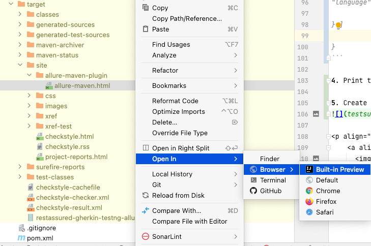

### Access Allure reports: (after maven run)

1. Perform a maven run as suggested
2. Then go to terminal and run ```mvn allure:report```
3. Open site within target folder in IntelliJ -> /target/site/allure-maven-plugin
4. Right-click on the html file generated and select open in new browser / intelliJ preview
5. Reports will be opened
   

<p align="center">
    <a align="middle" href="https://github.com/ParthibanRajasekaran/restassured-gherkin-testng-allure/blob/main/README.md">Take me back
      
    </a>
</p>