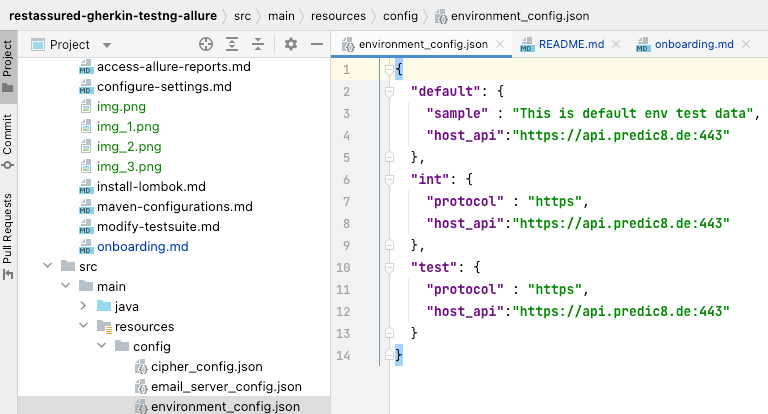
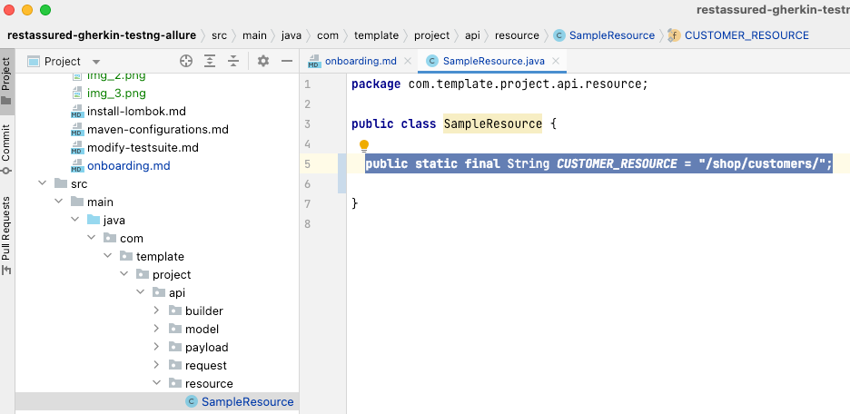
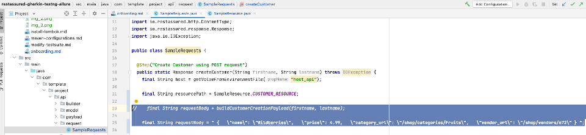
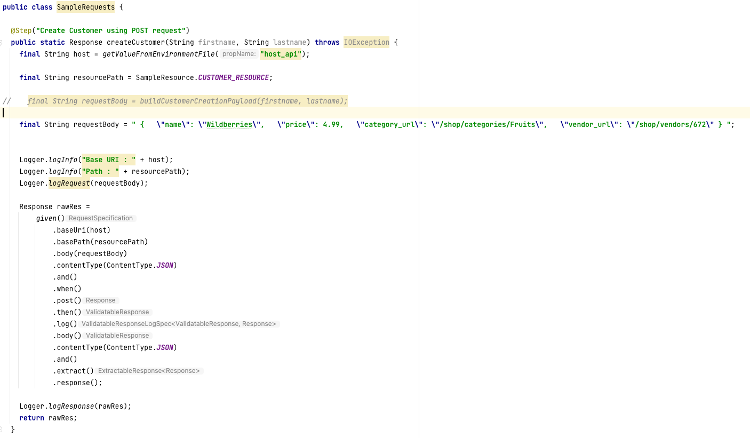
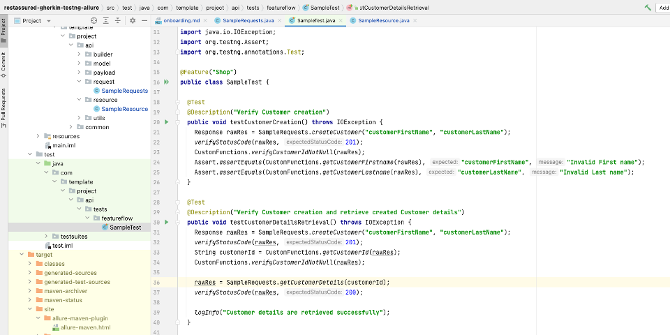

### Primary Task

1. Provide the base uri (Uniform Resource Identifier) via environment_config file within
   resources/config <br />
   
2. Provide the resource in the resource class <br />
   
3. Provide request body (Payload) as a string <br />
   (comment out :  //String requestBody = SamplePayload.buildCustomerCreationPayload(firstname,
   lastname);
   _Example_:
   ```String requestBody = " {   "name": "Wildberries",   "price": 4.99,   "category_url": "/shop/categories/Fruits",   "vendor_url": "/shop/vendors/672" } "``` <br />
   
4. Create sample requests (POST / GET / PUT / DEL) <br />
   
5. Create tests for the response received to make your tests more effective <br />
   

<br />

<div style="display: flex; justify-content: space-between; text-align:center;">
<p align="left">
    <a align="center" href="https://github.com/ParthibanRajasekaran/restassured-gherkin-testng-allure/blob/be2b0f9474304532da05b7ef881a0482fe6f2477/docs/onboarding.md">Take me back to Onboarding
      
    </a>
</p>
<p align="right">
    <a align="right" href="https://github.com/ParthibanRajasekaran/restassured-gherkin-testng-allure/blob/main/docs/secondary-task.md">Take me to Secondary Task
      
    </a>
</p>
</div>

