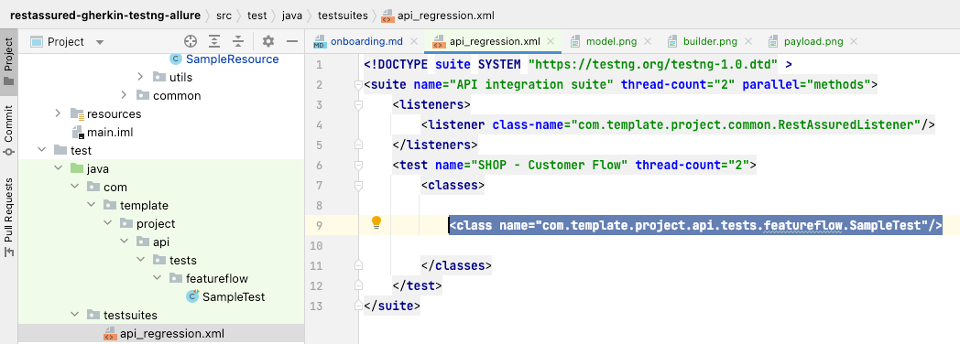

### Secondary Task

1. Create a model <br />
   
2. Create a builder <br />
   
3. Build the payload by parsing JSON objects <br />
   
   <br />

##### _Build below payloads_:

**Payload 1:**

```
{
"name": "Payload1",

"task": "build a payload",

"onboardingAutomationTool": "rest-assured",

"onboardingProgrammingLanguage": "Java"
}
```

**Payload 2:**

```
{
"name": "Payload2",

"task": "build a payload",

"onboarding": {

"tool": "sampleTool",

"language": "sampleLanguage"
}

} 
```

**Payload 3:**

```
{

"name": "Payload3",

"task": "build a Payload",

"program": {

"duration": 4 ,

"sector": "quality assurance"

} ,

"onboarding": [ {

"tool": "Selenium",

"language" : "Java"

}, {

"tool" : "Rest-Assured",

"language" : "Java"

} ]

}
```

4. Print the payload created

5. Create a test suite
   

<br />
<br />


<div style="display: flex; justify-content: space-between; text-align:center;">
<p align="left">
    <a align="middle" href="https://github.com/ParthibanRajasekaran/restassured-gherkin-testng-allure/blob/be2b0f9474304532da05b7ef881a0482fe6f2477/docs/primary-task.md">Take me back to Primary Task
      
    </a>
</p>
<p align="right">
    <a align="middle" href="https://github.com/ParthibanRajasekaran/restassured-gherkin-testng-allure/blob/be2b0f9474304532da05b7ef881a0482fe6f2477/docs/onboarding.md">Take me back to Onboarding
      
    </a>
</p>
</div>